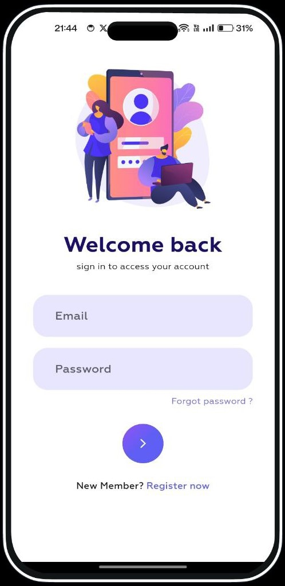

  
  <h1>Horaz: A Chat App</h1>

Horaz is a feature-rich Flutter chat application designed to streamline your communication experience. With its intuitive user interface and comprehensive set of features, Horaz simplifies messaging, making it easier than ever to connect with friends, family, and colleagues.

## Features

- **Real-time Messaging:** Stay connected with instant messaging that delivers messages in real-time.
- **Multimedia Sharing:** Share photos, videos, documents, and more with ease.
- **Group Chats:** Create group chats to communicate with multiple contacts simultaneously.
- **Voice and Video Calls:** Initiate voice and video calls to connect face-to-face or simply have a conversation.
- **Message Encryption:** Ensure privacy and security with end-to-end message encryption.
- **Customization Options:** Personalize your chat experience with customizable themes, fonts, and more.

## Preview

  

   <h3>Call History Screen</h3>
   
View your call history and keep track of your conversations.

    
   

   <h3>Create Group Screen</h3>
   
Create group chats to communicate with multiple contacts simultaneously.

    
   
   

   <h3>Drawer Screen</h3>
   
Access additional features and settings from the drawer menu.

    
   

   <h3>Group Chat Screen</h3>
   
Engage in group conversations with multiple participants.

    
   

   <h3>Home Screen</h3>
   
Access your chats and conversations from the home screen.

    
   

  

  

   <h3>Login Screen</h3>
   
Sign in to your account to access your chats and settings.

    
   

   <h3>Search Screen</h3>
    
Search for contacts, messages, and other content within the app.

    
   

   <h3>Sign Up Screen</h3>
   
Create a new account to start using the app.

    
   

   <h3>Story Screen</h3>
   
View and share stories with your contacts.

    
   

  

## Walkthrough Video

Watch the walkthrough video to see Horaz in action:

[Horaz Walkthrough Video](https://drive.google.com/file/d/1wCgua9ZdbeNzUQUGwQrCfpoZUvyuf5Q4/view?usp=sharing)
